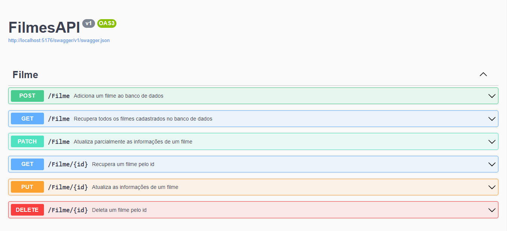

# Sistema de cadastro de filmes com ASP.NET

<p>Sistema WebApi de cadastro de filmes, onde permite cadastrar uma lista de filmes. Utilizando o método CRUD que permite obter os registros, criar, salvar e deletar esses registros. Com integração ao banco de dados do MySQL.

## Métodos do sistema

**Swagger**



</br>

```json
{
  "titulo": "string",
  "genero": "string",
  "duracao": 0,
  "horaDaConsulta": "2023-11-16T12:47:14.279Z"
}
```

## Tópicos abordados durante esse projeto:

- Requisições Http
- Entity Framework
- Conexão com o BD MySQL

## Tecnologias utilizadas no projeto

- .NET
- C#
- MySQL

<hr>
</br>

[](https://www.linkedin.com/in/jeancarlotorre619b/)

<h3>Contribuindo</h3>

⭐️ Star o projeto

🐛 Encontrar e relatar issues
